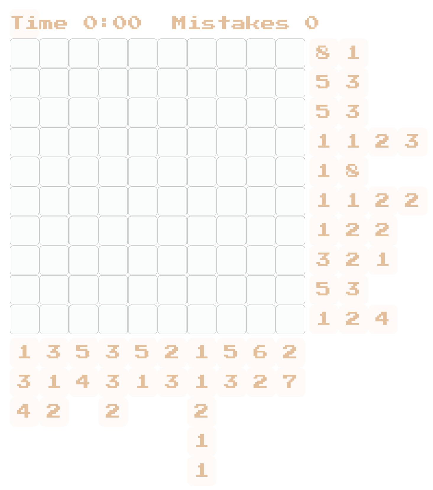

# Nonograms
An implementation of the puzzle game Nonograms, in Scala.

The engine is completely immutable, and all components are nicely separated with no strong binding between UI and game logic.

There is a web UI, produced by transpiling Scala UI logic into Javascript with ScalaJS.

## Status
Playable.
Update: due to some missing code, probably not checked-in and now lost, the game is runnable but not playable - e.g. mouse clicks will not do anything.

The solver AI is coming along and can find a solvable 10x10 puzzle usually given 20 random boards or less, but it could be a lot smarter. 

## Usage
Clone the project.

```sbt fastOptJS```

Then open src/main/resources/www/html/index.html in Chrome.  You should see a display like this:


## Deploying to Personal Site
(These instructions are just for me)

```
sbt fullOptJS
cp src/main/resources/www/css/nonograms.css ../www/hugo/static/css
cp target/scala-2.12/nonograms-opt.js ../www/hugo/static/js/
```